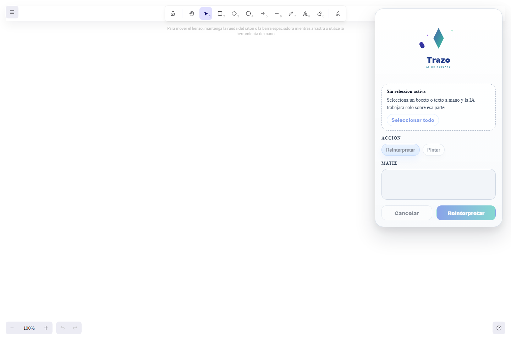
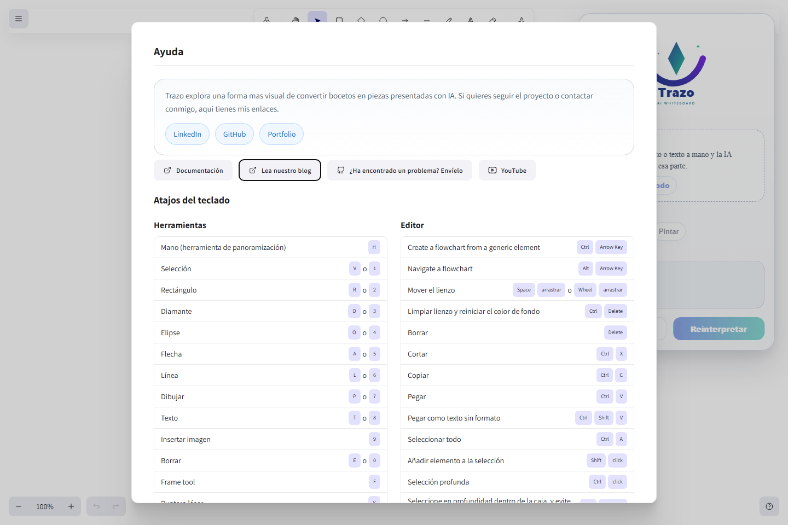

# TRAZO

  

  <strong>Una pizarra con IA pensada para transformar bocetos y texto manuscrito en piezas visuales mas claras sin salir del canvas.</strong>

  <a href="http://194.26.100.74">Demo en vivo</a> |
  <a href="https://github.com/albertogalvez-dev/trazo">Repositorio</a> |
  <a href="https://www.linkedin.com/in/alberto-galvez-aguado/">Autor</a>

## Demo

- Demo publica en CubePath: [http://194.26.100.74](http://194.26.100.74)
- Repositorio publico: [https://github.com/albertogalvez-dev/trazo](https://github.com/albertogalvez-dev/trazo)

## Sobre el proyecto

Trazo es una herramienta visual que parte de una idea muy simple: dibujar rapido y mejorar despues.

En lugar de convertir la experiencia en un chat o en un generador de diagramas desde cero, Trazo trabaja sobre una seleccion real del lienzo. El usuario boceta, selecciona solo la zona que quiere transformar y la IA devuelve una reinterpretacion visual dentro del propio canvas.

El objetivo es reducir el salto entre una idea rapida y una version mas presentable, manteniendo la inmediatez de la pizarra.

## Que aporta

- Reinterpretacion visual de bocetos y texto manuscrito
- Trabajo sobre seleccion real, no sobre prompts aislados
- Flujo rapido dentro del canvas sin cambiar de herramienta
- Interfaz guiada y centrada en una sola accion util
- Demo publica desplegada en CubePath

## Como se usa

1. Entras en la pizarra.
2. Dibujas una idea, una mini interfaz o texto a mano.
3. Seleccionas la zona que quieres mejorar.
4. Anades un matiz opcional si quieres orientar el resultado.
5. Pulsas `Reinterpretar`.
6. Trazo sustituye esa seleccion por una version visual mas cuidada.

## Caracteristicas principales

- Canvas construido sobre Excalidraw
- Panel de IA flotante y arrastrable
- Deteccion real de seleccion
- Boton `Seleccionar todo`
- Acciones `Reinterpretar` y `Pintar`
- Campo `Matiz` para afinar la reinterpretacion
- Tour guiado en espanol
- Modal de ayuda personalizado con enlaces del autor

## Capturas

### Pantalla de entrada

### Canvas y panel de IA

### Ayuda personalizada

## Stack

- React
- TypeScript
- Vite
- Excalidraw
- CSS normal
- Node.js
- Vertex AI Express Mode
- Nginx
- PM2

## CubePath

Trazo esta desplegado en un VPS de CubePath en Barcelona. La aplicacion se publica con Nginx, corre sobre Node.js y se mantiene viva con PM2.

He utilizado CubePath para levantar una demo publica real del proyecto de forma rapida, con una configuracion simple y suficiente para una aplicacion web de este tipo.

## Autor

Alberto Galvez

- LinkedIn: [https://www.linkedin.com/in/alberto-galvez-aguado/](https://www.linkedin.com/in/alberto-galvez-aguado/)
- GitHub: [https://github.com/albertogalvez-dev](https://github.com/albertogalvez-dev)
- Portfolio: [https://albertogalvez-dev.github.io/](https://albertogalvez-dev.github.io/)

## Hackathon CubePath 2026

Proyecto presentado a la Hackathon de CubePath organizada por midudev.

- Repositorio oficial: [https://github.com/midudev/hackaton-cubepath-2026](https://github.com/midudev/hackaton-cubepath-2026)
- Reglas: [https://github.com/midudev/hackaton-cubepath-2026#-reglas](https://github.com/midudev/hackaton-cubepath-2026#-reglas)
